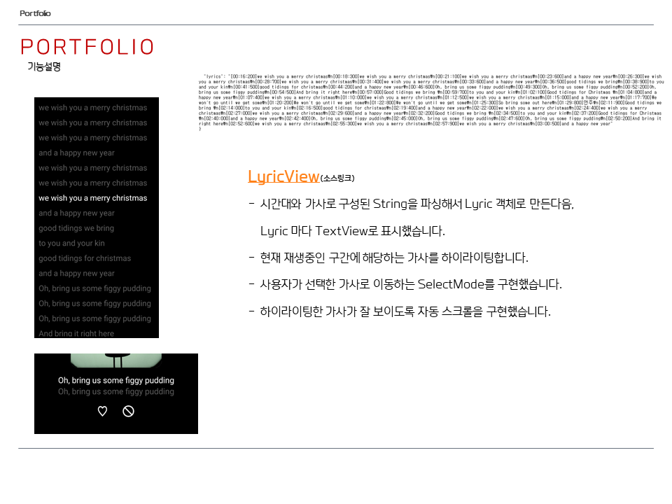

# FLO
모바일앱 FLO의 클론앱입니다.</br>
웹서버에서 음악정보를 받아 재생하는 음악 플레이어 앱입니다.
음악 플레이를 제어하기위한 CustomView를 제작하는데 중점을 두었습니다.

## 사용기술
Kotlin, Android Studio, Retrofit, MVVM, Hilt, Databinding, Custom View

## 실행법
```
# 깃 허브에서 소스코드를 다운로드 받습니다.
git clone https://github.com/bsw112/anime_worldcup.git

# 안드로이드 스튜디오로 빌드합니다. 개발환경은 4.1 버전입니다.
```


## 주요기능
* 서버에서 음악을 받아 재생합니다.
* Seekbar를 조절해 원하는 재생 구간으로 이동할 수 있습니다.
* 현재 나타내야할 가사를 하이라이팅 합니다.
* 현재 나타내야할 가사를 자동 스크롤을 통해 편하게 보여줍니다.
* 가사를 클릭하면 그 가사에 해당하는 재생 구간으로 이동합니다.

## 실제화면



